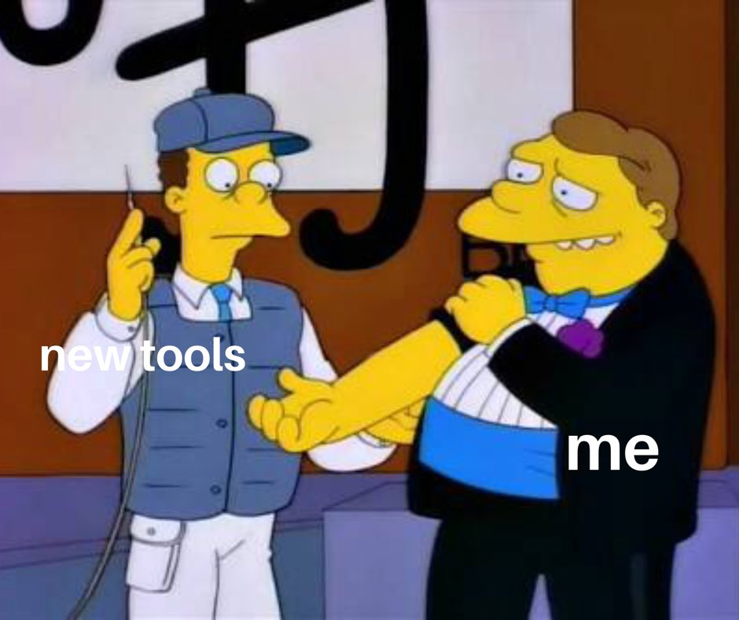
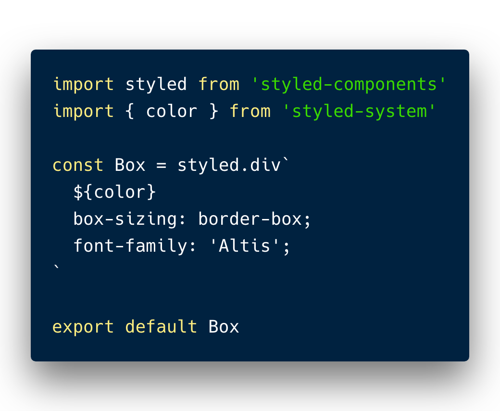
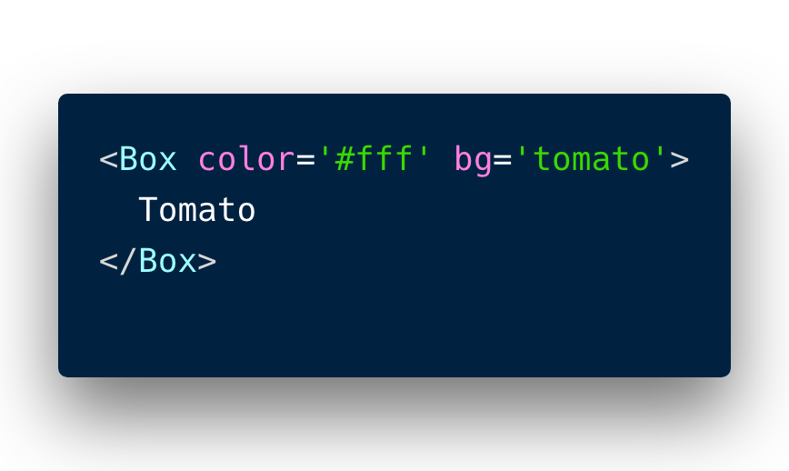
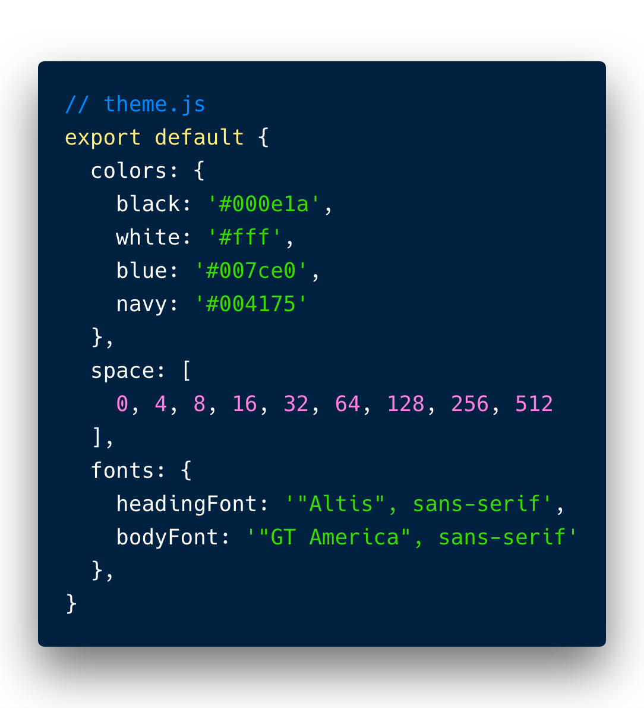
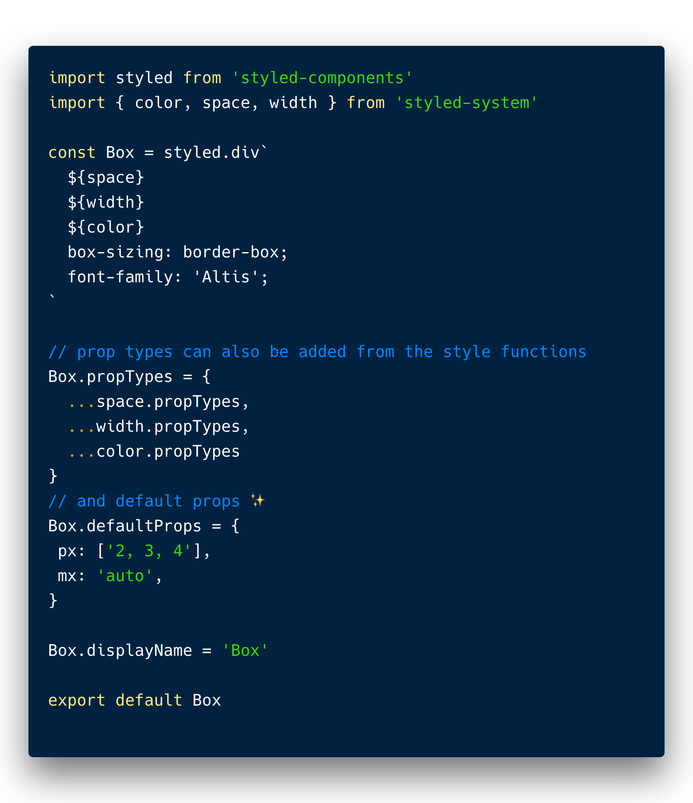
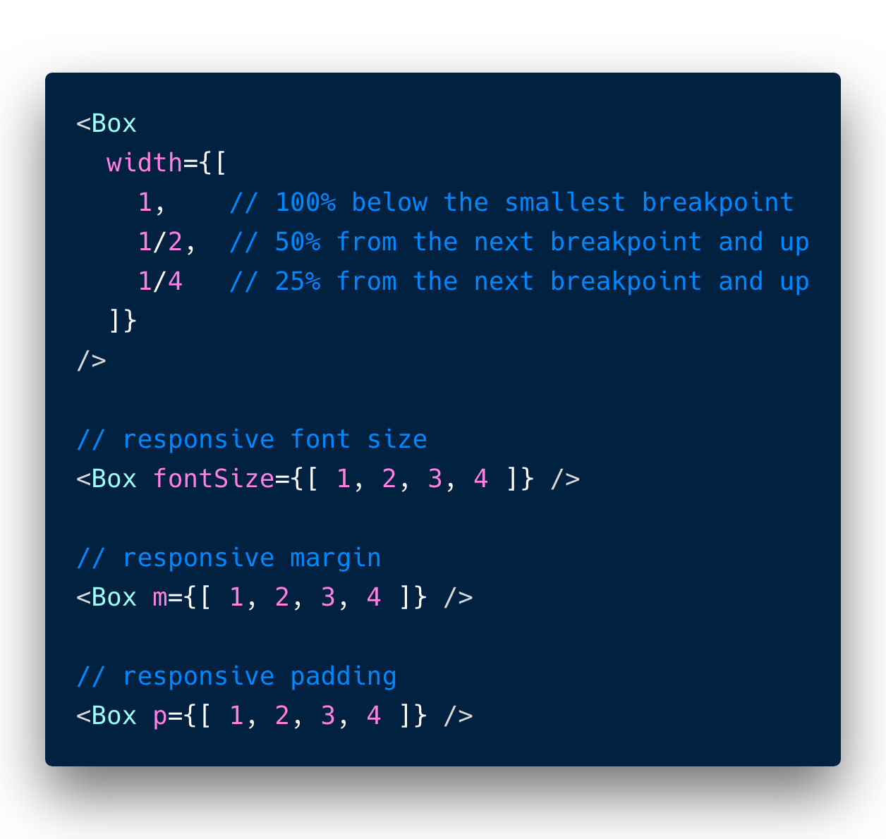
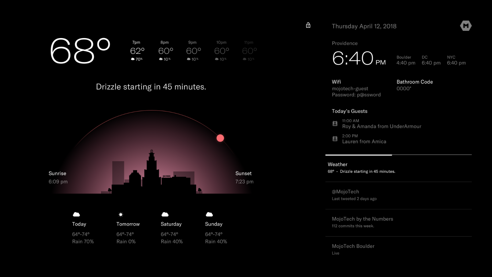
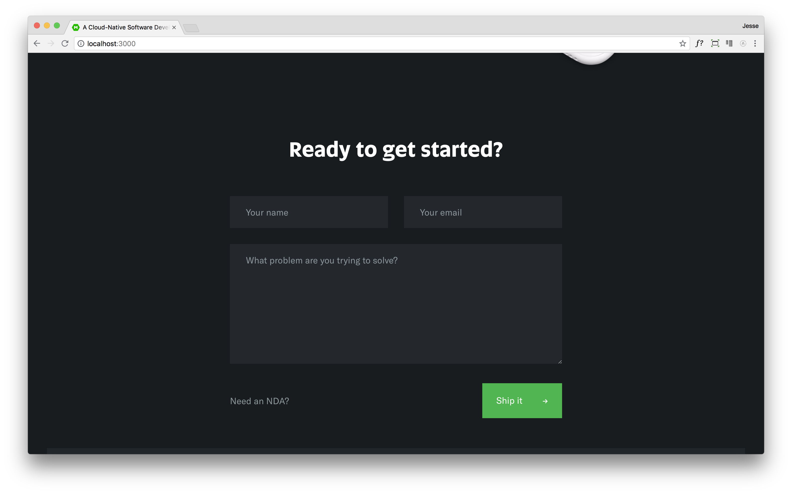

export { yellow as theme } from 'mdx-deck/themes';
import { Appear } from 'mdx-deck';
import { Split, Invert } from 'mdx-deck/layouts'
import {Flex, Box} from 'grid-styled';



---

# Styled-System
### An Introduction

```notes
Why are we here? McD asked us to set up a demo to demonstrate the uses of this library, and if it would be beneficial to use on client projects. Spurred by the revelations of Pinterest Gestalt and other design systems
*So what is it?*
```
---

#### Put simply
### Design system utilities for CSS-in-JS

---

## Why are design Systems a thing?
### and why should we care

```notes
- They may seem like a fad, but in actually design systems have existed for a long time.
- They were made help large companies, spanning many mediums, maintain visual (amoung other things) consistency
- Digital product companies are now growing and seeing that design systems solve a very real problem for theme
- Its no wonder the gold rush to add typing to JS and design systems are raising in popularity in tandem, they solve many of the same issues on different fronts
- Design matters, the first trillion dollar company in history is one that from the start placed immense value on design, this is not a coincidence
```

---


```notes
- nycsubway system allowed for new subway terminals to be contructed, designed, quicker while maintaining consistency that built trust with the passengers/users
- A sturdy Digital design system helps us scale applications faster and maintain quality, and it encompasses more than visuals, it goes into the code. 
- *Back to styled system, what is it?*
```

---


### Basically
<Flex alignItems="center">
  <Appear>
    <Box>
      
    </Box>
    <Box>
      
    </Box>
  </Appear>
</Flex>

```notes
This component will have two style props available: color to set foreground color, and bg to set background color.
```

---
### The plot thickens
<Flex>
  <Box >
    
  </Box>
</Flex>

```notes
- Most CSS-in-JS libraries use a ThemeProvider to handle theming in React. Import the styled-components ThemeProvider in the root of your application and pass the theme to the theme prop.
- With the ThemeProvider, the Box component now has access to the colors defined in the theme object.
- Styled-system will attempt to find a value based on keys in the theme and fallback to the raw value if it's not defined in the theme.
```

---

<Flex alignItems={"center"}>
  <Appear>
    <Box>
      
    </Box>
    <Box>
      
    </Box>
  </Appear>
</Flex>

```notes
- Styles become easier to enforce thanks to proptypes 
- Instead of manually managing media queries and adding nested style objects throughout a code base, styled-system offers a convenient shorthand syntax for adding responsive styles with a mobile-first approach.
```

---

# Demo Time
```notes
- lets discuss practical uses
- emphasis using styled-system as a utility, not replacing styled components, or hand written Styles
```

---

```notes
helios is an elegantly designed app, that leverages mostly type and space. These things are easy to codify in a theme file, perfect candidate for styled system...
```



---

```notes
The contact form is something that is made up of basic html elements, and doesnt appear in many place...for now. Because of that, the layout and styling is clumped together, this approach is not ideal for scaling.
```



---


### Pros
- Effortlessly compose styles
- Encourages working with a theme, makes it easy
- Using props-types to enforce styling
- Responsive, Mobile-first styling made trivial
- Easy to sprinkle into existing projects
- Works with styled-components and other css-in-js libraries (emotion, glamourous)

### Cons
- Shaky TypeScript support (for now)
- Unable to change prop names without some work 
- Can become difficult to decide when to seperate functional props from styling props